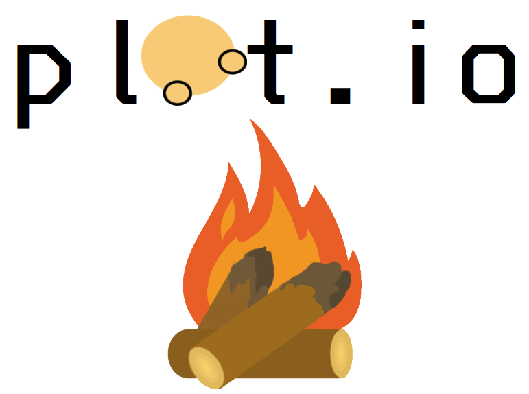
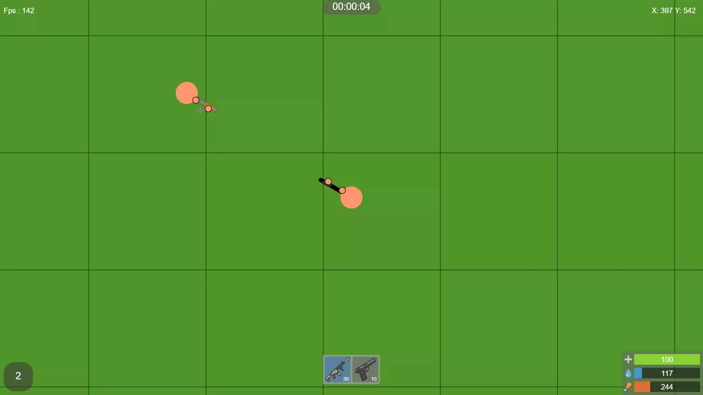
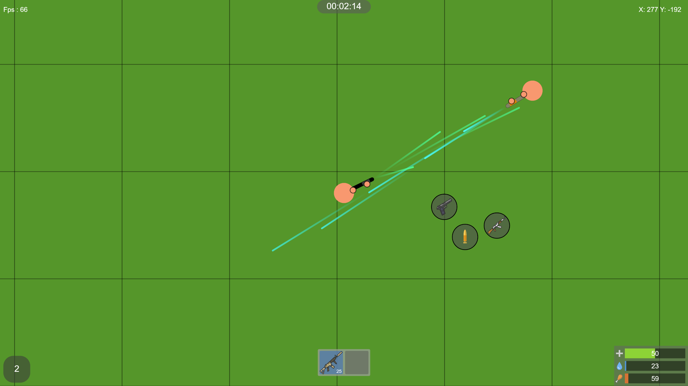
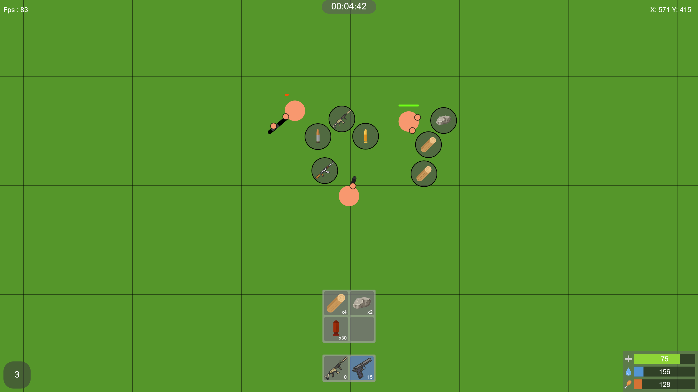
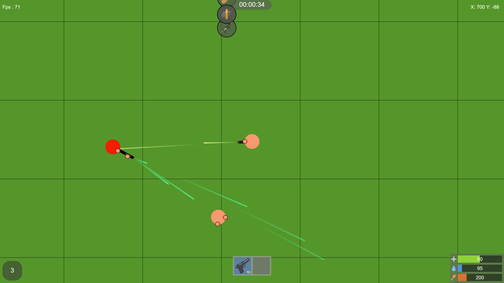
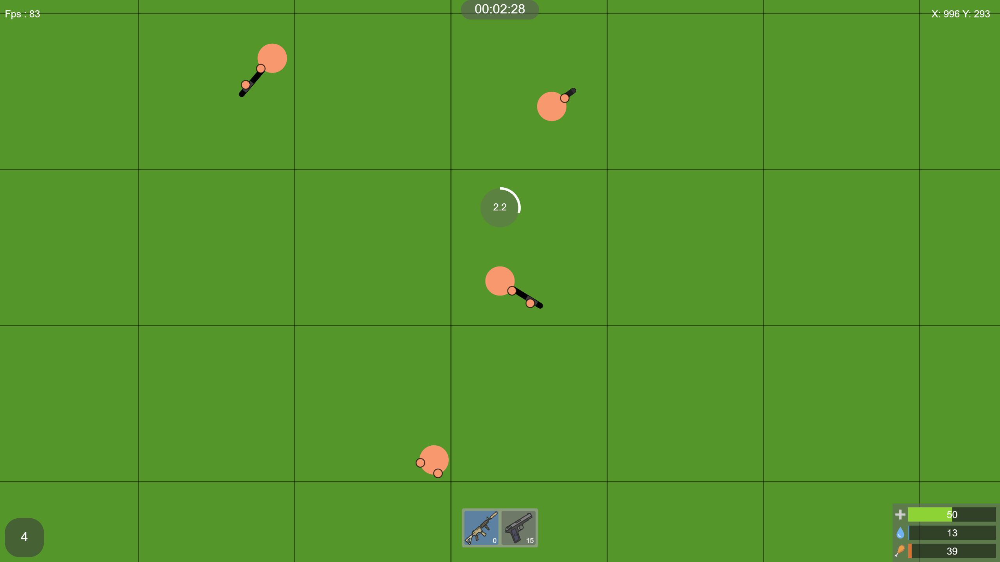

# plot.io

## A 2D open world online survival game.
#### Inspired by [surviv.io](https://surviv.io). The difference is that this is shittier and nothing actually works.
### Uses libraries:
* [Socket.io](https://www.npmjs.com/package/socket.io) (network)
* [P5.js](https://p5js.org) (graphics)
* [Howler.js](https://www.npmjs.com/package/howler) (audio)

 

## Gamemodes
* Free For All - [/?game=FFA:{room}](http://plot.io/?game=FFA)
* Battle Royal - [/?game=BATTLE_ROYAL:{room}](http://plot.io/?game=BATTLE_ROYAL)

 

## Controls
### Player
* Movement - `W` `A` `S` `D`

* Aim - `MOUSE`

* Melee/Shoot - `MB1`

* Reload Weapon - `R`

* Go To Fists - `X`

* Hold Item From Quickslot - `1-9`

* Drop Current Holding Item - `G`

* Pickup A Dropped Item - `E`
### Inventory
* Toggle Inventory - `TAB`

* Move Item - `MB1`

* Split Item - `MB2`

* Move 1 Of Item - `MB3`

 

